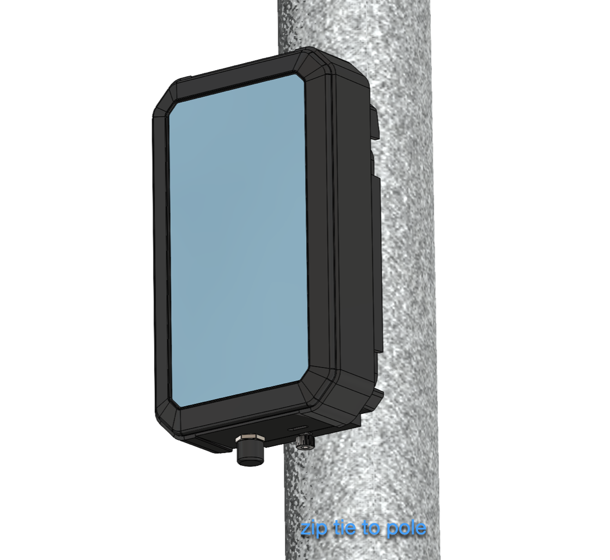
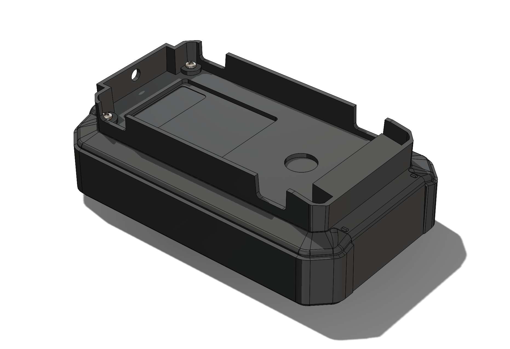

# Project Varia: Tracker One Mounting System

Welcome to the open-source repository for the Tracker One Mounting Bracket, aka Project Varia, a retrofit mounting system for the [Particle Tracker One](https://www.particle.io/tracker-one/). The aim of this project is to provide a comprehensive, flexible, and easy-to-implement mounting solution for easily and securely mounting the Tracker One to any asset or system, facilitating hassle-free deployment in any environment.

This repository contains a selection of assets and design files for the mounting system, including detailed 2D drawings, a comprehensive Bill of Materials (BOM), STEP files, and STL files for 3D printing.

## Features

The Project Varia mounting system meets a variety of requirements, including:

- Utilizing existing screw threads/holes and extending the threads to maintain a secure interface and preserve the IP67 rating
- Serving as a single-piece bracket that can accommodate a variety of mounting configurations
- Allowing for both horizontal and vertical zip tie installation
- Facilitating secure screw fixing
- Enabling DIN Rail mounting
- Allowing for pole mounting
- Providing an easy installation process
- Ensuring that labels, ports, lights are not obstructed
- Utilizing metric (not imperial) fasteners

## Repository Contents

The repository consists of an asset folder and a hardware folder.

### Asset Folder

The asset folder contains images and a video illustrating various aspects of the mounting system. These include:

- [Backplate design](./assets/Backplate_1.png)
- [Pole mount illustrations](./assets/Pole_Mount.png), [Pole_Mount2](./assets/Pole_Mount2.png)
- [Rear assembly design](./assets/Rear_Assembley.png), [Rear_Assembley2](./assets/Rear_Assembley2.png)
- [Thread insert design](./assets/Thread_Insert.png)
- [A video demonstrating magnetic mounting](./assets/magnetic_mounting_video.MOV)

### Hardware Folder

The hardware folder contains detailed design files that can be used for manufacturing the mounting system. These include:

- Detailed 2D drawings of the system components
- [A comprehensive Bill of Materials (BOM.xlsx)](./hardware/BOM.xlsx)
- STEP files for 3D CAD compatibility
- STL files for 3D printing

## Usage

Feel free to use these designs as a reference for creating your own Tracker One mounts or use them directly in your designs. If you choose to use these designs, you can have the parts CNC machined for immediate use. We love [fictiv](https://www.fictiv.com) at Particle for our professional CNC and 3D printing needs, but there are lots of good alternatives available in the global market that are just as good!

## Contributing

As an open-source project, we encourage contributions and suggestions. If you have an idea for an improvement or notice a bug, please open an issue or submit a pull request.

## License

This project is open source and available under the [Apache License 2.0](LICENSE).
